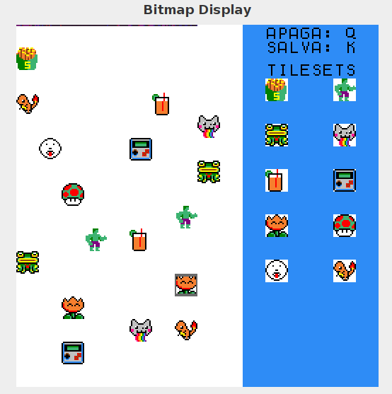

# Projetos Assembly Mips
Alguns código em assembly mips que fiz para estudo da disciplina Arquitetura e Organização de Computadores.

Procurei deixar tudo bem comentado para facilitar o estudo, você pode utilizar como quiser.

São códigos de:

- Jogo da Velha - Utilizando o bitmap display para visualização do tabuleiro e o console para seleção da jogada;

- Movimentação de Personagem - Utilizando o bitmap display para visualizar a movimentação do personagem para cima, direita, esquerda e baixo, e o Keyboard Simulator para leitura da tecla apertada;

- Fatorial Recursivo - Código que calcula o fatorial de um número recursivamente;

- Tocar música - Pequeno exemplo de como tocar alguns sons em mips, com um exemplo de música sendo tocada com instrumentos aleatórios;

- Euler - Encontra uma aproximação para o número de Euler através da fórmula (1/n!), com n variando de 0 a 9;

- EditArchive - Edita um arquivo existente tornando determinadas palavras maiúsculas.

- Interface - Programa para preencher na tela desenhos pré-prontos, como na imagem:

> Abra o arquivo interface/Main.asm para ver as instruções de como executar esse programa.

- Pixel Art - Programa de pixel art, com 11 cores possíveis de serem utilizadas.

* O quadrado cinza é o cursor.

> Abra o arquivo interface/tela.asm para ver as instruções de como executar esse programa.
